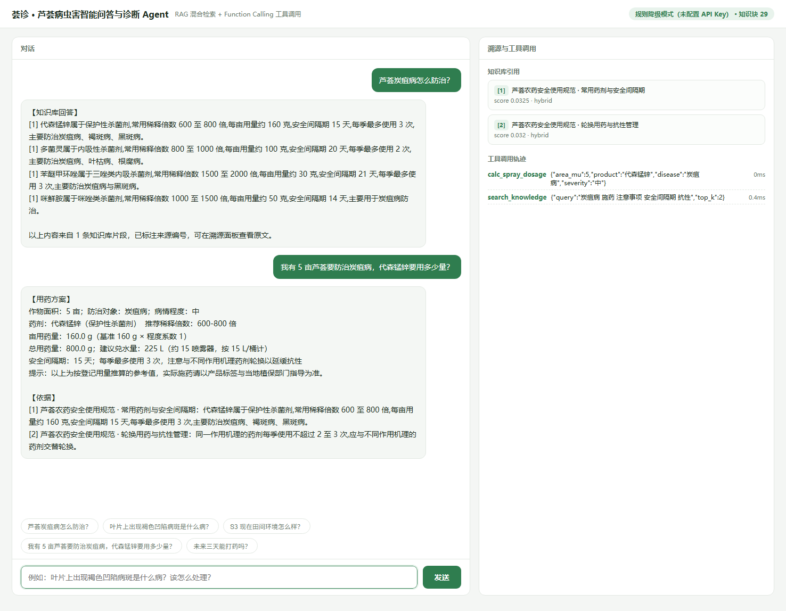

# 荟诊 · 芦荟病虫害智能问答与诊断 Agent

> 面向芦荟种植场景的 **RAG + Function Calling** 智能体：把毕业设计沉淀的领域知识做成受控知识库，
> 让种植户和技术员用自然语言"问诊"，答案**句句可溯源**、建议**可执行**。

**在线体验**：<https://zy1025-agri-rag-agent.ms.show> · 国内直连、无需登录、打开即可对话

**项目状态**：38 项单元测试全部通过 · 30 条标注用例完成检索评测（Hybrid Recall@3 = 1.000 / MRR = 0.944）·
无需 GPU、无需 API Key 即可跑通完整链路



---

## 一、为什么做这个项目

直接拿通用大模型回答"芦荟炭疽病该打什么药"存在三个致命问题：

| 问题 | 后果 |
| --- | --- |
| **会编造** | 凭空给出农药名称和稀释倍数，在农业场景是真实的安全事故 |
| **不落地** | 不知道本地当季的温湿度，给不出针对性建议 |
| **不可信** | 没有出处，农技员不敢照着执行 |

所以这个项目的重点不是"接一个大模型"，而是**给模型加约束**：

1. **知识受控** —— 答案只能来自检索到的知识库片段，并且必须标出引用编号（`[1]` `[2]`）
2. **计算外包** —— 用药量、减产率这类数值不让模型"心算"，交给确定性工具计算
3. **优雅降级** —— 没有网络、没有 Key 时降级为抽取式回答，宁可少说，不能胡说

---

## 二、核心能力

| 能力 | 说明 |
| --- | --- |
| **混合检索** | BM25（小节标题加权）与向量召回并行，用 RRF 融合排序，兼顾专有名词精确匹配与语义泛化 |
| **引用溯源** | 每个结论标注来源章节，引用台账按答案实际引用裁剪，杜绝"幽灵引用" |
| **查询扩展** | 内置农业领域同义词表（病名／症状／药剂），把口语化提问对齐到专业术语 |
| **Function Calling** | 5 个工具：知识检索、田间环境查询、用药量计算、叶片图像诊断、病害趋势预报 |
| **多轮对话** | 保留最近 6 轮上下文，支持"那这种药要打几次"这类省略式追问 |
| **流式输出** | SSE 逐事件推送工具调用轨迹与最终答案，前端实时展示推理过程 |
| **三层向量化降级** | 本地 BGE 模型 → 云端 Embedding API → 内置 TF-IDF，按可用性自动选择 |
| **离线可跑** | `AGRI_LLM_PROVIDER=offline` 时使用规则路由 + 抽取式回答，全链路可演示 |

---

## 三、系统架构

```
                     ┌──────────────────────────────────────┐
   浏览器 / curl ───▶ │           FastAPI 服务层             │
                     │  POST /chat        POST /chat/stream │
                     │  GET  /retrieve    /health   /tools  │
                     └───────────────────┬──────────────────┘
                                         │
                     ┌───────────────────▼──────────────────┐
                     │            Agent 编排层              │
                     │   LLMAgent  ⇄  OfflineAgent（降级）  │
                     │   · 多轮对话 · 工具路由 · 步数上限 6 │
                     │   · CitationLedger 引用台账          │
                     └────────┬──────────────────┬──────────┘
                              │                  │
            ┌─────────────────▼──────┐   ┌───────▼──────────────────┐
            │      RAG 检索管线      │   │   Function Calling 工具  │
            │  ┌──────────────────┐  │   │  · search_knowledge      │
            │  │ BM25  标题权重x4 │  │   │  · get_field_env         │
            │  ├──────────────────┤  │   │  · calc_spray_dosage     │
            │  │ Dense 向量召回   │  │   │  · diagnose_leaf_image   │
            │  ├──────────────────┤  │   │  · get_forecast          │
            │  │ RRF 融合排序     │  │   └──────────────────────────┘
            │  └──────────────────┘  │
            └─────────────┬──────────┘
                          │
      ┌───────────────────▼──────────────────────────────────┐
      │  离线索引：data/kb/*.md → 切分 → 向量化 → artifacts/ │
│  4 篇领域文档 · 29 个语义块 · 2484 维稀疏特征        │
      └──────────────────────────────────────────────────────┘
```

**一次问答的完整链路**

```
用户提问 ──▶ 查询扩展 ──▶ BM25 + Dense 双路召回 ──▶ RRF 融合 Top-K
        ──▶ Agent 决策（是否需要调用工具） ──▶ 工具执行 ──▶ 生成答案
        ──▶ CitationLedger 裁剪引用 ──▶ SSE 流式返回（轨迹 + 答案 + 引用）
```

---

## 四、检索效果评测

评测集：`eval/testset.jsonl`，30 条人工标注用例，覆盖病害识别、栽培管理、图像分级、农药规范四类问题。
评测脚本：`eval/run_eval.py`，支持"切分策略 x 检索器"的网格对比。

| 切分策略 | 检索器 | Recall@1 | Recall@3 | Recall@5 | MRR |
| --- | --- | --- | --- | --- | --- |
| **heading** | **BM25（标题加权）** | **0.900** | **1.000** | 1.000 | **0.944** |
| heading | Dense（向量） | 0.800 | 1.000 | 1.000 | 0.894 |
| heading | Hybrid（RRF） | **0.900** | **1.000** | 1.000 | **0.944** |
| fixed | BM25 | 0.800 | 0.967 | 0.967 | 0.878 |
| fixed | Dense | 0.733 | 0.933 | 0.967 | 0.842 |
| fixed | Hybrid | 0.800 | 0.967 | 0.967 | 0.878 |

复现命令：`python eval/run_eval.py --grid`

**结论与取舍**

- **按标题切分优于固定长度切分**：知识库是"病名即小节标题"的结构化文档，按语义边界切分能让单个语义块只讲一件事，
  Recall@3 由 0.967 提升到 1.000。这也是默认 `AGRI_CHUNK_STRATEGY=heading` 的原因。
- **BM25 在专有名词上强于向量**：病名、药剂名属于低频精确匹配，向量模型对"炭疽病 vs 褐斑病"这类同域近义词区分力有限，
  因此默认走混合检索而不是纯向量。
- **切分越碎，融合收益越大**：fixed 策略下单路召回更不稳定，Hybrid 相对 Dense 的 Recall@3 提升 3.3 个百分点；
  heading 策略下单路已足够强，融合的边际收益变小 —— 说明**切分质量才是检索效果的第一性因素**。

---

## 五、工程问题复盘

以下三个问题都是在开发过程中真实暴露、定位并修复的。

### 1. 病名只出现在小节标题里，导致漏召

**现象**：问"黑斑病的症状是什么"，BM25 的 Top1 是《常用药剂与安全间隔期》，黑斑病小节掉到第 3 位。

**定位**：切分后小节的标题仅作为元数据保存，没有进入 BM25 的索引字段。原始文档中"黑斑病"三个字只出现在小节标题里，
正文用"该病"指代，于是正文与查询词在字面上完全不重叠。

**解决**：把标题与章节路径拼进可检索文本，并给予 4 倍词频权重（BM25F 的简化实现），
使查询词命中小节标题的片段得分显著抬升。

**效果**：heading + BM25 的 Recall@1 达到 0.900，30 条用例中仅 3 条未排在首位。

### 2. 切分器按空行拆块，小节被切碎

**现象**：同一小节被拆成 4–5 个碎片，向量召回质量下降。

**定位**：`chunker` 最初直接按 `\n\n` 切分，而原始文档中段落之间正是用空行分隔的，
结果一个完整语义单元被切成若干短句，既让 TF-IDF 的 IDF 被细碎文本稀释，也让向量语义不完整。

**解决**：改为两阶段切分 —— 先按标题切出小节边界，小节内部先合并段落、再按最大长度（420 字符）滑窗，
窗口间保留 80 字符重叠，保证任何语义块都不会跨越小节。

**效果**：heading 策略下 Recall@3 达到 1.000，全面优于 fixed 策略。

### 3. 引用台账产生"幽灵引用"

**现象**：模型答案正文里只出现 `[1] [2]`，但接口返回的引用列表却有 5 条，
前端展示出用户根本没用到的来源 —— 相当于给用户看假证据，直接违背项目的可溯源设计目标。

**定位**：`CitationLedger` 在检索和工具调用阶段就把所有候选片段登记进台账，
生成答案后从未按实际引用做裁剪，台账与正文是两套互相独立的编号体系。

**解决**：新增 `_finalize()`，在答案生成后扫描正文中真实出现的 `[n]`，
按出现顺序裁剪台账并重排编号，保证不变量 **引用列表 ⊆ 答案正文引用** 恒成立。

**效果**：引用与结论严格一一对应，该不变量已由单元测试覆盖。

---

## 六、快速开始

环境要求：**Python 3.10+**（无需 GPU、无需数据库）

```powershell
# 1. 安装依赖
python -m venv .venv
.venv\Scripts\Activate.ps1
pip install -r requirements.txt

# 2. 配置（可全部留空，默认离线模式即可跑通）
Copy-Item .env.example .env

# 3. 生成田间环境示例数据，并构建向量索引
python scripts\make_env_data.py
$env:PYTHONPATH = "src"
python -m agri_agent.cli build

# 4. 启动服务，浏览器访问 http://127.0.0.1:8000
uvicorn agri_agent.serving.api:app --app-dir src --port 8000
```

Windows 下也可以直接运行一键脚本：

```powershell
.\run.ps1
```

### 部署到公网

仓库根目录提供通用入口 `app.py`（监听 `7860`，也支持平台注入的 `$PORT`）与开箱可用的 `Dockerfile`：

```bash
docker build -t agri-rag-agent .
docker run -p 7860:7860 agri-rag-agent
```

面向国内网络环境的完整部署步骤（含各平台可达性实测）见 [`docs/DEPLOY.md`](docs/DEPLOY.md)。

### 接入大模型（可选）

默认 `AGRI_LLM_PROVIDER=offline`，不调用任何外部接口，用规则路由 + 抽取式回答保证全链路可跑。
在 `.env` 中填入 Key 后自动切换为 Function Calling Agent，任何 **OpenAI 兼容**接口都可直接使用
（DeepSeek / 通义千问 / 智谱 / Moonshot / OpenAI）：

```ini
AGRI_LLM_PROVIDER=deepseek
AGRI_LLM_BASE_URL=https://api.deepseek.com/v1
AGRI_LLM_MODEL=deepseek-chat
AGRI_LLM_API_KEY=sk-xxxx
```

向量化同理：`AGRI_EMBED_PROVIDER=auto` 会依次尝试
**本地 BGE 模型 → 云端 Embedding API → 内置 TF-IDF**，任何一层可用即可工作。

---

## 七、接口说明

| 方法 | 路径 | 说明 |
| --- | --- | --- |
| `GET` | `/` | 内置单页 Web 界面（对话 + 溯源面板 + 工具轨迹） |
| `POST` | `/chat` | 单轮／多轮问答，返回答案、引用与工具调用轨迹 |
| `POST` | `/chat/stream` | SSE 流式问答，逐事件推送 `step` / `final` / `error` |
| `GET` | `/retrieve` | 仅执行检索，支持 `mode=hybrid\|bm25\|dense` 与 `top_k`，用于调参与排查 |
| `GET` | `/tools` | 返回已注册工具的 JSON Schema |
| `GET` | `/health` | 服务状态、当前 Agent 类型、知识库统计、工具列表 |

```bash
curl -X POST http://127.0.0.1:8000/chat \
  -H "Content-Type: application/json" \
  -d '{"message":"芦荟炭疽病怎么防治？"}'
```

```bash
curl "http://127.0.0.1:8000/retrieve?q=炭疽病%20发病条件&mode=hybrid&top_k=5"
```

交互式接口文档：<http://127.0.0.1:8000/docs>

---

## 八、命令行用法

```bash
agri-agent build                              # 构建索引（可指定 --strategy 与 --embed-provider）
agri-agent ask "芦荟炭疽病怎么防治？" --trace    # 单次提问并打印工具调用轨迹
agri-agent retrieve "炭疽病 发病条件" --mode hybrid --top-k 5   # 仅检索，便于调参
agri-agent chat                               # 交互式多轮对话
```

---

## 九、项目结构

```
agri-rag-agent/
├─ data/
│  ├─ kb/                    4 篇领域知识文档（Markdown，按小节组织）
│  └─ env/field_env.csv      示例环境数据（5 个监测点 x 14 天，结构同真实网关数据）
├─ src/agri_agent/
│  ├─ config.py              集中配置（环境变量 / .env）
│  ├─ cli.py                 build / ask / retrieve / chat 子命令
│  ├─ llm.py                 OpenAI 兼容客户端 + Function Calling
│  ├─ text.py                归一化、分词、字符 n-gram、分句
│  ├─ rag/
│  │  ├─ loader.py           多格式文档加载
│  │  ├─ chunker.py          heading / fixed 两种切分策略
│  │  ├─ embedder.py         三层降级的向量化实现
│  │  ├─ store.py            numpy 向量索引与落盘
│  │  ├─ retriever.py        BM25 + Dense + RRF 混合检索
│  │  ├─ expand.py           领域同义词查询扩展
│  │  └─ pipeline.py         KnowledgeBase 门面
│  ├─ agent/
│  │  ├─ tools.py            5 个工具 + CitationLedger 引用台账
│  │  └─ agent.py            LLMAgent / OfflineAgent
│  └─ serving/
│     ├─ api.py              FastAPI + SSE
│     └─ static/index.html   单页前端
├─ eval/
│  ├─ testset.jsonl          30 条标注用例
│  ├─ run_eval.py            网格评测脚本
│  └─ reports/               评测报告与指标
├─ scripts/                  数据生成与索引构建脚本
├─ tests/                    38 项单元测试
├─ app.py                    线上部署入口（监听 7860 / $PORT）
├─ Dockerfile                通用容器镜像
├─ docs/DEPLOY.md            国内网络环境部署指南
└─ artifacts/index/          构建产物（可重建）
```

---

## 十、技术选型与取舍

| 选择 | 理由 |
| --- | --- |
| **不引入 LangChain 等框架** | 检索链路不到 500 行，自研可完全掌控切分、打分与降级逻辑，避免框架黑盒带来的调参困难 |
| **不引入向量数据库** | 29 个语义块、单机场景，numpy 矩阵点积已足够，少一个服务依赖就少一份部署成本 |
| **不用 faiss / annoy** | 规模未到需要近似最近邻的阈值，暴力检索反而精确且零编译依赖 |
| **jieba 可用则用，否则字符 n-gram 降级** | 保证在未安装分词库的环境下依然可检索，不牺牲可移植性 |
| **RRF 而非加权分数融合** | BM25 与余弦相似度量纲不可比，RRF 只依赖排名，免去调权重的负担 |

---

## 十一、已知限制

- 知识库目前覆盖芦荟单一作物，扩展新作物需要补充文档并重建索引
- 田间环境数据为**示例数据**（由 `scripts/make_env_data.py` 固定随机种子复现生成），并非真实监测记录；
  接入真实数据只需替换 `data/env/field_env.csv`，字段结构保持一致即可
- TF-IDF 降级模式的语义泛化能力弱于真实 Embedding 模型，生产环境建议配置 BGE
- `diagnose_leaf_image` 目前为接口占位，返回固定结构，尚未接入训练好的视觉模型
- 评测集规模为 30 条，指标用于横向对比不同策略的相对优劣，不代表线上绝对水平

**后续计划**：接入视觉模型完成端到端诊断闭环 · 补充多作物知识库 · 引入交叉编码器重排序 ·
增加答案忠实度自动评估
